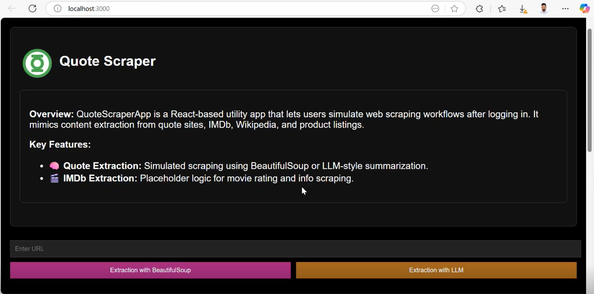
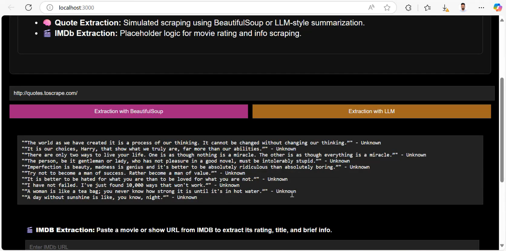
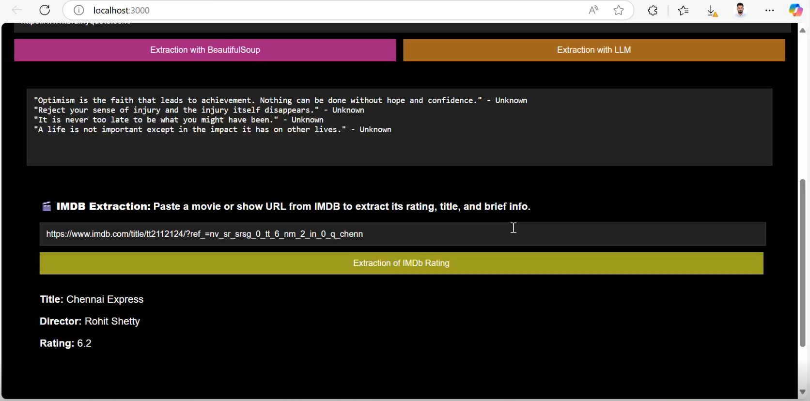
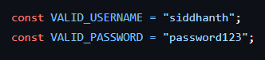

# Scrapper-Quotes-from-Web-using-BeautifulSoup
In the era of data-driven applications, the ability to extract relevant information from the internet has become a foundational skill. Web scraping is the process of programmatically collecting and parsing web data using software tools.​

# Feature
- Scrapes quotes and their authors from the websites

- Extracts tags/keywords related to each quote
- Save data in structured format (CSV/JSON)

- Lightweight and easy-to-run
- IMDB movie info scarpping is also done as a additional feature

# Work Pending
- The quotes also need to be extracted with LLM format and getting error if any help given for improving it can be appreciated. 

# FYI
- Also created a login page where you haave to enter "USERNAME" and "PASSWORD"

 

